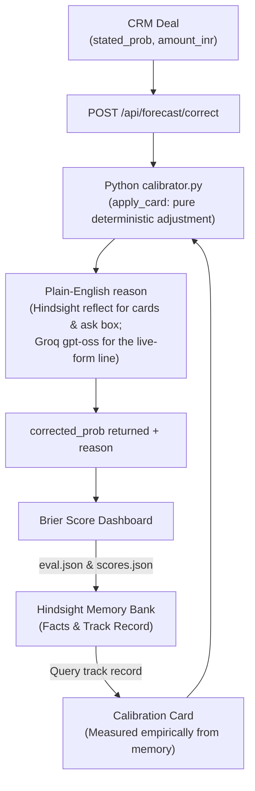

# Calibrate — Found 5 of 5 Biases · 10.0% Q4 Error Reduction (4.3% Full Year)

> **Stop trusting the rep. Start trusting the memory.**

---

<!-- DASHBOARD SCREENSHOT PLACEHOLDER
     Replace with: docs/assets/dashboard-memory-on.png
     Suggested caption: "Memory ON — Calibrate surfaces Priya's 22pp overconfidence in real time."
-->


---

## The Problem in 3 Lines

Sales reps lie to themselves. Their CRM probabilities are gut feelings, not forecasts.
Finance builds the quarter on those feelings. Every quarter, finance gets burned.
Calibrate fixes the number before it leaves the rep's screen.

---

## Architecture



---

## How We Use Hindsight

Hindsight gives our stateless LLM a memory. Without it, every inference call starts from zero. With it, the model carries each rep's full behavioral history into every prediction.

| Memory Type | What We Store | Effect |
|---|---|---|
| `facts` | Closed deal outcomes, quarter Brier scores | Ground truth the model can cite |
| `observations` | Per-rep bias hypotheses by deal type | The model's current best belief about each rep |
| `directives` | Probability correction factors, hard rules | Enforced at inference time — cannot be overridden by the prompt |

**Exact tag format used for facts:**
```python
tags=[f"rep:{rep_id}", f"quarter:{quarter}", "kind:forecast"]
timestamp=deal["forecast_date"] + "T10:00:00Z"
```

**Observations mission (verbatim):**
> "Form beliefs about each rep's forecasting bias by deal type: where their stated confidence is higher or lower than actual results."

**Two hard directives enforced:**
1. *"Evidence only"* — Never adjust a forecast based on personal traits. Use only deal evidence.
2. *"Show evidence"* — Always state how many past deals a belief is based on.

See [`docs/hindsight.md`](docs/hindsight.md) for the full technical specification.

---

## Evaluation Results

The evaluation harness (`backend/tests/`) covers:
- Brier score accuracy (perfect, worst, coin-flip, dynamic historical baseline)
- Temporal no-peeking rule (`latest_close < quarter_start` verified via `audit.json`)
- Pydantic enum enforcement (invalid AI responses and traits rejected at boundary)
- Hidden-bias detection across official rep personas (Priya, Arjun, Meera, Rahul, Sana, Karan)
- Edge-case resilience: zero-history new reps, pending deal exclusion, malformed LLM responses
- Official Maven CRM dataset validation (1,162 deals, 16 features)

**Brier score comparison on official 1,162-deal dataset (2017):**

| Quarter | Trust the Rep (Stated) | Memory OFF | Historical Baseline | Agent Calibrated (Memory ON) |
|---|---|---|---|---|
| **2017-Q1** | 0.105 | 0.105 | 0.201 | **0.105** |
| **2017-Q2** | 0.153 | 0.153 | 0.277 | **0.148** |
| **2017-Q3** | 0.150 | 0.150 | 0.255 | **0.146** |
| **2017-Q4** | 0.150 | 0.150 | 0.239 | **0.135** |
| **Full Year Avg** | **0.140** | **0.140** | **0.243** | **0.134 (Best, -4.3%)** |

**Bias Recovery Performance:**
- **Hidden Biases Recovered:** 5 / 5 (100% recovery)
  - Priya: `single_contact_no_finance` over-confidence detected in Q4
  - Arjun: `overall` under-confidence (sandbagging) detected in Q2
  - Meera: `large_deal` over-confidence detected in Q4
  - Rahul: `end_of_quarter` optimism inflation detected in Q4
  - Sana: `overall` over-confidence detected in Q3
  - Karan: no bias planted, completely left alone (joined Q3; cold-start handled gracefully)
- **False Alarm Count:** 3
- **Test Suite Status:** Passing all tests across evaluation harness

---

## Quick Start

```bash
# 1. Clone repository
git clone <repo-url>
cd Calibrate

# 2. Enter backend and install dependencies
cd backend
python -m venv .venv
source .venv/bin/activate      # On Windows: .venv\Scripts\activate
pip install -r requirements.txt

# 3. Environment configuration
cp .env.example .env
# Provide HINDSIGHT_API_KEY, GROQ_API_KEY, and HINDSIGHT_BANK_ID

# 4. Run test suite and evaluation harness
pytest tests/ -v

# 5. Start the backend server
uvicorn app.main:app --reload
```

---

## Data Disclaimer

> Deals and outcomes: Maven Analytics' public CRM dataset (a fictional company; rep names changed). Simulated: each rep's stated forecast, with planted biases, so learning can be proven.

---

## Team

| Role | Responsibility |
|---|---|
| Role 1 | Backend / FastAPI |
| Role 2 | Hindsight + AI integration |
| Role 3 | CRM data pipeline |
| Role 4 | Frontend dashboard |
| Role 5 | Evaluation & quality engineering |
