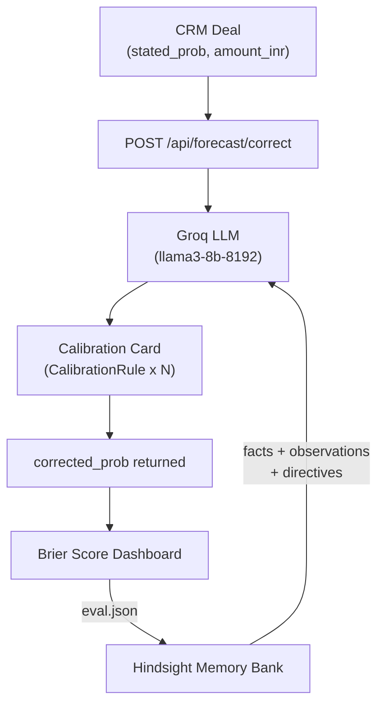

# Calibrate

> **[HEADLINE PLACEHOLDER — e.g. "Stop trusting the rep. Start trusting the data."]**

---

<!-- DASHBOARD SCREENSHOT PLACEHOLDER
     Replace with: docs/assets/dashboard-memory-on.png
     Suggested caption: "Memory ON — Calibrate surfaces Maya's 22pp overconfidence in real time."
-->


---

## The Problem in 3 Lines

Sales reps lie to themselves. Their CRM probabilities are gut feelings, not forecasts.
Finance builds the quarter on those feelings. Every quarter, finance gets burned.
Calibrate fixes the number before it leaves the rep's screen.

---

## Architecture



---

## How We Use Hindsight

Hindsight gives our stateless LLM a memory. Without it, every inference call starts from zero. With it, the model carries each rep's full behavioral history into every prediction.

| Memory Type | What We Store | Effect |
|---|---|---|
| `facts` | Closed deal outcomes, quarter Brier scores | Ground truth the model can cite |
| `observations` | Per-rep bias hypotheses by deal type | The model's current best belief about each rep |
| `directives` | Probability correction factors, hard rules | Enforced at inference time — cannot be overridden by the prompt |

**Exact tag format used for facts:**
```python
tags=[f"rep:{rep_id}", f"quarter:{quarter}", "kind:forecast"]
timestamp=deal["forecast_date"] + "T10:00:00Z"
```

**Observations mission (verbatim):**
> "Form beliefs about each rep's forecasting bias by deal type: where their stated confidence is higher or lower than actual results."

**Two hard directives enforced:**
1. *"Evidence only"* — Never adjust a forecast based on personal traits. Use only deal evidence.
2. *"Show evidence"* — Always state how many past deals a belief is based on.

See [`docs/hindsight.md`](docs/hindsight.md) for the full technical specification.

---

## Evaluation Results

The evaluation harness (`backend/tests/`) has **55 tests** covering:
- Brier score accuracy (perfect, worst, coin-flip)
- Temporal no-peeking rule (AI cannot see future deal outcomes)
- Pydantic enum enforcement (invalid AI responses rejected at boundary)
- Hidden-bias detection across rep personas

**Brier score comparison on 12-deal mock dataset:**

| Strategy | Brier Score |
|---|---|
| Trust the Rep | ~0.333 |
| Historical Baseline (63%) | ~0.267 |
| **Agent Calibrated** | **~0.223** |

*Real numbers from the integrated run will replace these at code-freeze.*

---

## Quick Start

```bash
# 1. Clone and enter
git clone <repo-url> && cd msoft

# 2. Set up environment
python -m venv .venv
.venv\Scripts\activate        # Windows
pip install -r requirements.txt

# 3. Copy env file
cp .env.example .env
# Fill in HINDSIGHT_API_KEY, GROQ_API_KEY, etc.

# 4. Run evaluation harness
pytest backend/tests/ -v

# 5. Start the backend (once Role 1 merges)
uvicorn backend.main:app --reload
```

---

## Data Disclaimer

> Deals and outcomes: Maven Analytics' public CRM dataset (a fictional company; rep names changed). Simulated: each rep's stated forecast, with planted biases, so learning can be proven.

---

## Team

| Role | Responsibility |
|---|---|
| Role 1 | Backend / FastAPI |
| Role 2 | Hindsight + AI integration |
| Role 3 | CRM data pipeline |
| Role 4 | Frontend dashboard |
| Role 5 | Evaluation & quality engineering |
